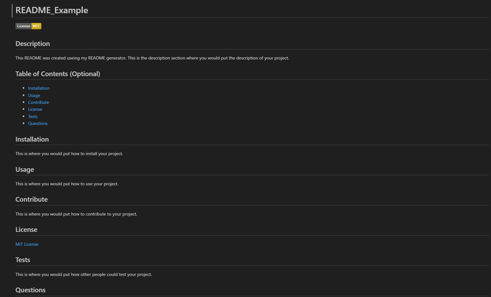

# WeekNineChallenge_ReadMeGenerator

## Description

  I made this application to better my understanding of node.js. I built this project to know more about how node.js and javascript work. This application solves the problem of having to spend time working on a README. This application will help save time so you can work on coding. I leraned from making this project was how to create and run code without using a browser.

## Installation
  
  -You will need Node.js installed
  -You will need inquirer installed

## Usage
  
  To run the application in your terminal you have to use node index.js. Then you will need to answer the prompts given to you.

  This is an example of the README that you will get:

  

  link to my repository: (https://github.com/FoundEven/WeekNineChallenge_ReadMeGenerator)

